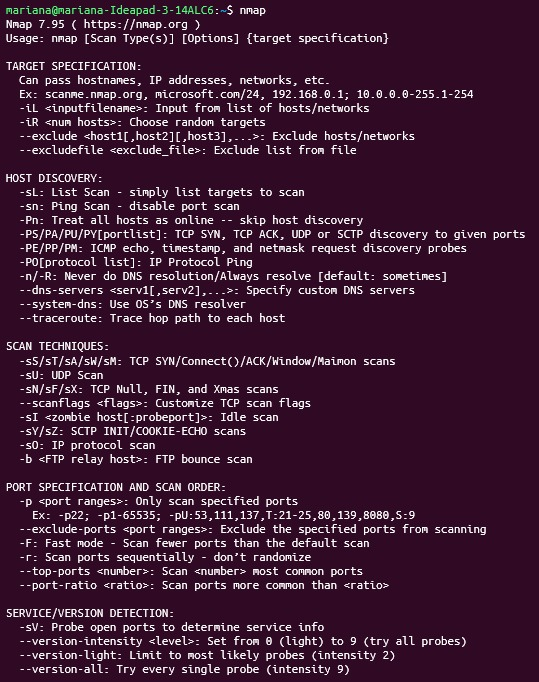

# Tarea 7 Monitoreo del Sistema y Análisis de Red en Linux

## Descripción General
Este proyecto desarrolla el análisis del rendimiento y la red en sistemas Linux utilizando herramientas de monitoreo, auditoría y diagnóstico como **htop**, **glances**, **ifconfig**, **nmap** y **lynis**.  
Además, se incluyen conceptos sobre **IPv4 e IPv6**, el proceso de **instalación de Arch Linux**, y la creación del repositorio con documentación e imágenes.

---

## 1. Información mostrada por `htop` y herramientas complementarias

### 🔹 ¿Qué es `htop`?
`htop` es una herramienta interactiva que muestra el **uso de CPU, memoria, procesos y carga del sistema** en tiempo real.  
Permite detener procesos, cambiar prioridades y observar el comportamiento de los recursos.

#### Campos principales:
| Campo | Descripción |
|--------|--------------|
| PID | Identificador del proceso |
| USER | Usuario propietario |
| %CPU / %MEM | Porcentaje de uso de CPU y memoria |
| TIME+ | Tiempo total de CPU utilizado |
| COMMAND | Comando o proceso en ejecución |

#### Ejemplo de uso htop:

#### Herramientas complementarias: 
| **Herramienta** | **Función principal**                                                         | **Comando básico**        | **Resultado esperado**                                                    |
| --------------- | ----------------------------------------------------------------------------- | ------------------------- | ------------------------------------------------------------------------- |
| **htop**        | Monitorea procesos del sistema, CPU, RAM y carga general en tiempo real.      | `htop`                    | Muestra una interfaz interactiva con uso de recursos y procesos activos.  |
| **glances**     | Supervisa todos los recursos del sistema (CPU, RAM, red, disco, temperatura). | `glances`                 | Vista global del rendimiento del sistema con estadísticas detalladas.     |
| **ifconfig**    | Configura y muestra las interfaces de red y sus direcciones IP.               | `ifconfig`                | Lista de interfaces de red activas con su IP, máscara y estado.           |
| **nmap**        | Escanea redes y puertos para detectar hosts activos y servicios abiertos.     | `nmap 192.168.1.0/24`     | Muestra los dispositivos conectados y los puertos disponibles.            |
| **lynis**       | Realiza auditorías de seguridad en el sistema operativo Linux.                | `sudo lynis audit system` | Reporte de vulnerabilidades, configuraciones inseguras y recomendaciones. |

#### Instalacion de glances:

  
Fig1

## 2. IPv4 e IPv6 y comandos en Ubuntu
### IPv4

#### Protocolo de 32 bits.

#### Formato: 192.168.1.10

#### Máx. ~4.3 mil millones de direcciones.

### IPv6

#### Protocolo de 128 bits.

#### Formato: fe80::f0a3:bdff:fe1d:9c01

#### Diseñado para soportar un número casi ilimitado de dispositivos.

### Comandos útiles en Ubuntu

```
ip a           # Muestra todas las interfaces
ip -4 a        # Solo direcciones IPv4
ip -6 a        # Solo direcciones IPv6
ifconfig       # Información de red
netstat -r     # Tabla de rutas
nmcli device show  # Información detallada de red
```

#### Ejemplo de ip a:


## 3. Instalación y explicación del proceso en Arch Linux
### Pasos resumidos:

#### Iniciar desde la ISO de Arch Linux
```
Boot Arch Linux (x86_64)
```

##### Verificar conexión a Internet
```
ip link
ping archlinux.org
```

#### Configurar hora
```
timedatectl set-ntp true
```

#### Particionar el disco
```
fdisk /dev/sda
```

#### Formatear particiones
```
mkfs.ext4 /dev/sda1
mkswap /dev/sda2
swapon /dev/sda2
```

#### Montar particiones e instalar el sistema base
```
mount /dev/sda1 /mnt
pacstrap /mnt base linux linux-firmware
```

#### Configurar sistema
```
genfstab -U /mnt >> /mnt/etc/fstab
arch-chroot /mnt
ln -sf /usr/share/zoneinfo/America/Bogota /etc/localtime
hwclock --systohc
```

#### Instalar y configurar GRUB
```
pacman -S grub
grub-install /dev/sda
grub-mkconfig -o /boot/grub/grub.cfg
```

#### Finalizar instalación
```
exit
umount -R /mnt
reboot
```

 📷 Ejemplo del proceso:
   
Fig2
   
Fig3
   
Fig4
 
Fig5
   
Fig6
  
Fig7
  
Fig8
 
